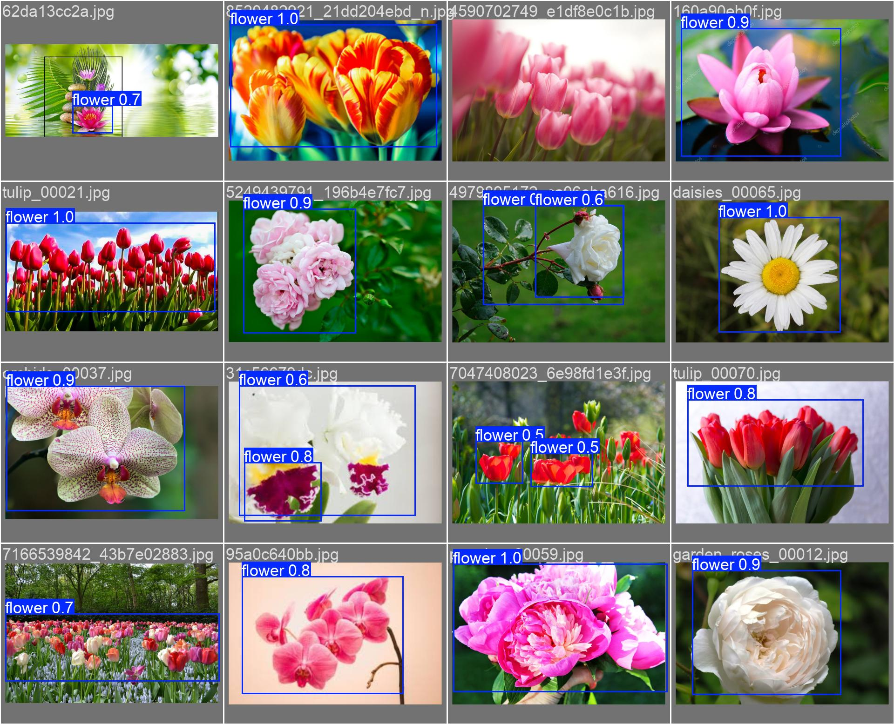
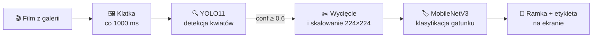

<h1 align="center">🌸 Flower Detector</h1>

<p align="center">
  <b>Wykrywanie i rozpoznawanie gatunków kwiatów na filmach – w pełni lokalnie, na Androidzie</b>
</p>

<p align="center">
  
  
  
  
  
  
</p>

<p align="center">
  
</p>

---

## 💡 O projekcie

**Flower Detector** odpowiada na pytanie *„Co to za roślina?”*. Aplikacja mobilna analizuje film klatka po klatce, lokalizuje kwiaty i rozpoznaje ich gatunek. Całość działa **offline na telefonie** dzięki modelom TensorFlow Lite.

Projekt łączy trzy obszary:
- 🔍 **detekcję obiektów** (YOLO) – gdzie na obrazie jest kwiat,
- 🏷️ **klasyfikację** (lekkie CNN / ViT) – jaki to gatunek,
- 🌱 **Green AI** – pomiar śladu węglowego treningu i wybór modelu z uwzględnieniem emisji CO₂.

Rozpoznawane gatunki: **lilia · lotos · orchidea · słonecznik · tulipan**

---

## 🏗️ Pipeline



---

## 📊 Dane

| | |
|---|---|
| **Źródło** | [5 Flower Types Classification Dataset](https://www.kaggle.com/datasets/kausthubkannan/5-flower-types-classification-dataset/data) (Kaggle) |
| **Klasy** | 5 gatunków × 1000 obrazów – zbiór zbalansowany |
| **Etykietowanie** | 500 obrazów oznaczonych ręcznie bounding boxami w **LabelImg** (format YOLO) |
| **EDA** | Liczność klas, rozmiary obrazów, przykładowe zdjęcia – różne formaty wymagały ujednoliconego preprocessingu |

---

## 🔍 Detekcja – YOLO

**Etap 1:** model bazowy **YOLOv8n** wykrywający jedną klasę `flower` (20 epok), testowany na filmie z internetu. Kolejne treningi (`runs/detect/train*`) pokazują, jak rosnąca liczba oznaczonych danych poprawia detekcję. Przebiegi zalogowane w **MLflow**.

**Etap 2 – eksperyment porównawczy (20+ modeli):**
- **YOLOv8n vs YOLO11n**, z augmentacją i bez
- osobny model dla każdego gatunku (5 klas × 2 architektury × 2 warianty augmentacji = **20 modeli**)
- jeden model wykrywający wszystkie kwiaty (jedna klasa)

<details>
<summary><b>Konfiguracja augmentacji</b></summary>

```yaml
augmentations:
  hsv_h: 0.015      # odcień
  hsv_s: 0.7        # nasycenie
  hsv_v: 0.4        # jasność
  degrees: 15       # rotacja
  translate: 0.1    # przesunięcie
  scale: 0.2        # skalowanie
  shear: 0.0        # pochylenie
  flipud: 0.5       # odbicie pionowe
  fliplr: 0.8       # odbicie poziome
  mosaic: 1.0       # łączenie kilku obrazów
  mixup: 0.2        # mieszanie dwóch obrazów
```
</details>

**Wybór:** do aplikacji trafił **YOLO11**. Trenował się ok. 25% dłużej i emitował więcej CO₂ niż YOLOv8, ale oferuje więcej możliwości przydatnych w dalszej części projektu.

---

## 🏷️ Klasyfikacja gatunku

Porównano 5 architektur zaprojektowanych z myślą o urządzeniach mobilnych:

| Model | Dokładność | Czas treningu | Emisja CO₂ |
|---|:-:|:-:|:-:|
| **MobileNetV3 Small** ✅ | ~99,4% | ~26 min | **~0,60 kg** |
| ViT Tiny | ~99,6% | ~28 min | ~0,64 kg |
| EfficientNet Lite0 | ~99,7% | ~29 min | ~0,66 kg |
| EfficientNet B0 (distilled) | ~99,8% | ~30 min | ~0,67 kg |
| UltraLight CNN | ~99,8% | ~30 min | ~0,68 kg |

**Wybór: MobileNetV3.** Najszybszy trening i najniższa emisja przy dokładności tylko o 0,4 p.p. niższej od najlepszego modelu – najlepszy kompromis między jakością a kosztem środowiskowym.

---

## 🌱 Green AI

Emisje CO₂ wszystkich treningów zmierzono i porównano:
- **YOLO11 z augmentacją** emituje najwięcej w każdej klasie, ale różnice między wariantami są niewielkie (~0,15–0,175 kg na model)
- przy modelu jednoklasowym różnica rośnie: **~1,18 kg (YOLOv8) vs ~1,49 kg (YOLO11)**
- czas treningu i emisja rosną niemal liniowo

> Łączna emisja wszystkich eksperymentów odpowiada mniej więcej **tygodniowi codziennych dojazdów samochodem** na trasie 40 km.

---

## 🔬 Wyjaśnialność (XAI)

Zastosowano **Grad-CAM**, aby sprawdzić, na co patrzy model. Mapy aktywacji koncentrują się na płatkach kwiatu, a nie na tle – rozumowanie modelu jest poprawne i zrozumiałe dla człowieka.

---

## 📱 Aplikacja Android

1. **Wybór filmu** z galerii urządzenia
2. **Analiza klatek** – 1 klatka na sekundę
3. **Detekcja** – YOLO zwraca ramki z poziomem pewności, wyniki poniżej **0.6** są odrzucane
4. **Klasyfikacja** – każda ramka jest wycinana, skalowana do 224×224 i klasyfikowana
5. **Wynik na żywo** – obraz z czerwonymi ramkami i etykietami, numer klatki i liczba wykrytych obiektów

Oba modele działają jako **TensorFlow Lite**, więc aplikacja nie potrzebuje internetu.

---

## 🧗 Wyzwania

- **Niekompatybilne wersje bibliotek** przy konwersji do TFLite – rozwiązane konfiguracją środowiska na Linuxie
- **Różne wymiary wejściowe modeli** – debugowanie przez Logcat w Android Studio i dopasowanie skalowania obrazów

---

## 🗂️ Zawartość repozytorium

| Element | Opis |
|---|---|
| `Sample_CNN.ipynb` | Pierwsze podejście do klasyfikacji (CNN) |
| `detect_video_frames.py` | Detekcja kwiatów na klatkach filmu wytrenowanym modelem |
| `convert_html_to_txt.py` | Skrypt pomocniczy do przetwarzania danych |
| `DATA/samples/` | Próbka danych: `train/`, `val/`, film testowy i wycięte klatki |
| `runs/detect/` | Wyniki kolejnych treningów YOLO (metryki, krzywe PR/F1, macierze pomyłek) |
| `runs/mlflow/` | Logi eksperymentów MLflow |

### ▶️ Uruchomienie detekcji

```bash
pip install ultralytics
python detect_video_frames.py
```
Wyniki z ramkami zapiszą się w `runs/detect/predict/`.

---

## 👩‍💻 Autorki

**Agnieszka Gruszka** · **Anna Sitkowska**
<br><sub>Projekt zrealizowany w ramach studiów na kierunku Informatyka Stosowana, Politechnika Bydgoska</sub>
